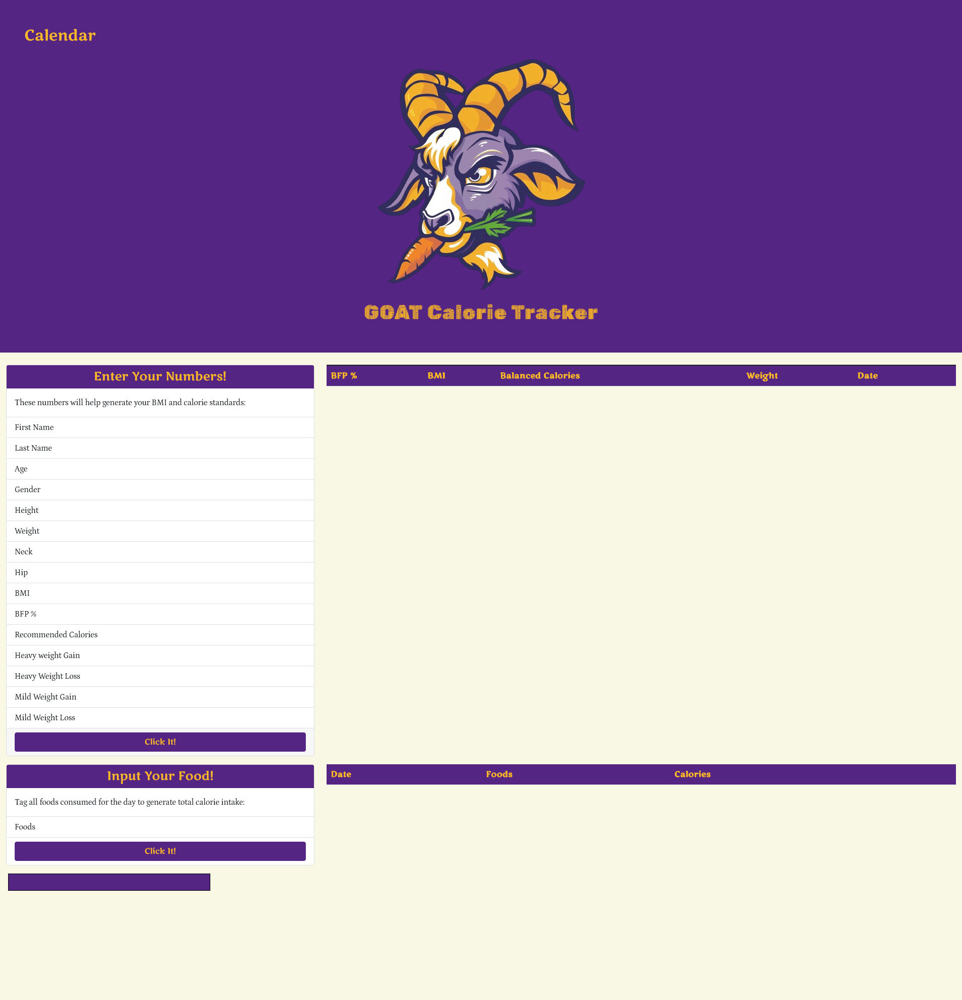
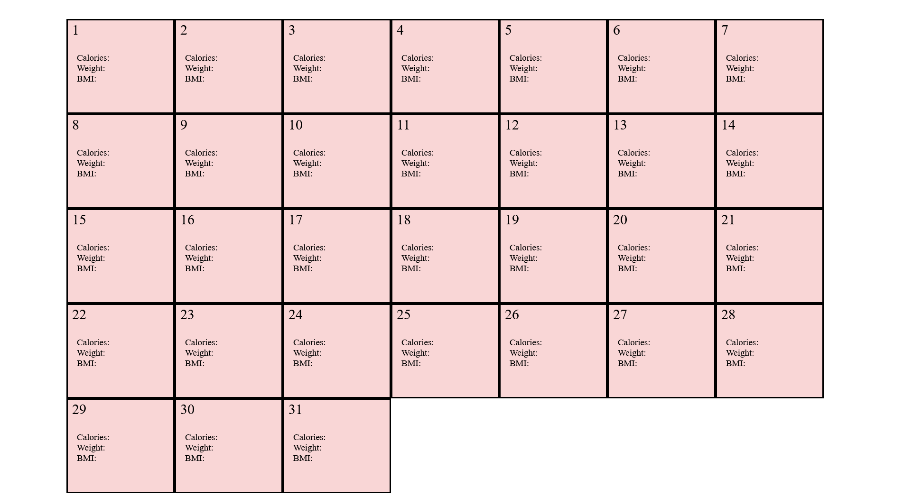

# Goat Calorie Tracker
Living a healthy lifestyle can be difficult and confusing. The motivation behind this development is to help those in need of keeping track of their caloric intake. 
In this program, we have integrated a BMI API that will help inform you of how much calories you need to consume in order to fit your need. Whether it is to gain weight, or lose weight, or maintain your current weight. 
This program will also help you keep track of those pesky calories, simply by inputting what food you ate, then spit back to you how much calories that food was.
This program used HTML,CSS, and Javascript to load elements onto the webpage and used fetch functions to call APIs. We also used Google Fonts, Bootstrap,dayjs and Jquery UI to improve our functionality. 

## Link to website
https://ojds2022.github.io/goat_calorie_tracker/

## Screenshot of Application

